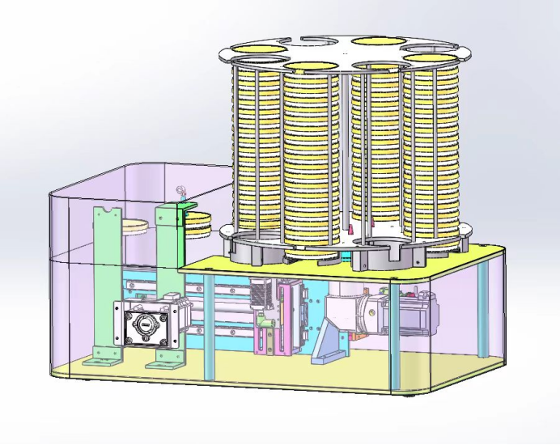
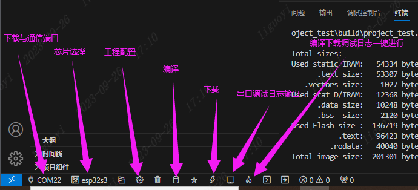

[TOC]

# ESP32-罐装机(流水线制作培养皿)

## 1.工作流程内容

> 总程序:
>
> 1. 初始化程序
> 2. 位置回零点程序
> 3. 罐装程序
> 4. 排空程序
> 5. 校准程序
> 6. 仪器自检程序

### 1.1机器模型

> 参数（根据示意图描述）
>
> 1. 电机A：培养皿架转动电机。
> 2. 电机B：培养皿进出栈方向电机。
> 3. 电机C：培养皿上下方向移动电机。
> 4. 电机D：培养皿旋转电机。
>
> - 泵E：下盖吸取泵。
> - 泵F：上盖吸取泵。
> - 泵G：灌装蠕动泵。
>
> - 舵机P：灌装管道位置舵机。
>
> 1. 传感器a：培养皿架位置传感器。
> 2. 传感器b：培养皿进出栈方向电机B可以移动到的最右端位置传感器。
> 3. 传感器c：培养皿进出栈方向电机B可以移动到的最左端位置传感器。
> 4. 传感器d：培养皿上下方向移动电机C可以移动到的最底端位置传感器。
> 5. 传感器e：培养皿上下方向移动电机C可以移动到的最上端位置传感器。
> 6. 传感器f：校准位置感应器。
>
> >位置x1：培养皿架编号1对应位置。
> >
> >位置x2：培养皿架编号2对应位置。
>
> >位置y0：培养皿进出栈方向与培养皿架对应位置。
> >
> >位置y1：培养皿进出栈方向电机B可以移动到的最右端位置。
> >
> >位置y2：培养皿进出栈方向电机B可以移动到的最左端位置。
> >
> >位置y3：培养皿进出栈方向取上盖位置。
> >
> >位置y4：培养皿灌装位置。
>
> >位置z1：培养皿上下方向移动电机C可以移动到的最底端位置。
> >
> >位置z2：培养皿上下方向移动电机C可以移动到的最上端位置。
> >
> >位置z3：培养皿上下方向出培养皿架位置。
> >
> >位置z4：培养皿吸取上盖位置。
> >
> >位置z5：培养皿不会碰到培养皿架底部位置。
> >
> >位置z6：培养皿上下方向进培养皿架位置。
> >
> >位置p1：灌装管道灌装位置。
> >
> >位置p2：灌装管道排空位置。
> >
> >位置p3：灌装管道校准位置。

### 1.2程序

#### 1.2.1初始化程序

A旋转到x1位置，a感应到信号，A停止。

B移动到y1位置，b感应到信号，B移动到y0位置，B停止。

C移动到z1位置，d感应到信号，C停止。

D旋转一圈，D接收到反馈信号，D停止。

#### 1.2.2位置回零点程序

A旋转到x1位置，a感应到信号，A停止。

B移动到y1位置，b感应到信号，B移动到y0位置，B停止。

C移动到z1位置，d感应到信号，C停止。

#### 1.2.3罐装程序

灌装m（m＜80）个培养皿，每个培养皿灌装n体积培养基。

（1）判断a感应器，是否感应到信号，如果没有，A旋转到x1位置，a感应到信号。

（2）根据设定灌装培养皿数量，培养皿架要移动到不同的初始位置。

#### 1.2.4灌装步骤程序

（1）C移动到z3位置，E打开。

（2）B移动到y3位置。

（3）C移动到z4位置，F打开。

（4）C移动到z3位置。

（5）B移动到y4位置。

（6）舵机P移动到p1位置，G打开，灌装tn时间，G关闭。

（7）B移动到y3位置。

（8）C移动到z4位置，F关闭。

（9）C移动到z5位置。

（10）B移动到y0位置，A旋转到x2位置。

（11）C移动到z6位置，E关闭。

（12）C移动到z5位置。

#### 1.2.5排空程序

（1）舵机P移动到p2位置，G打开，灌装t时间，G关闭。

#### 1.2.6校准程序

（1）舵机P移动到p3位置，G打开，f感应到信号，G关闭。

#### 1.2.7仪器自检程序

（1）A旋转到x1位置，a感应到信号，A停止。

B移动到y1位置，b感应到信号，B移动到y2位置，c感应到信号,B移动到y0位置，B停止。

C移动到z1位置，d感应到信号，C移动到z2位置，e感应到信号，C停止。

D旋转一圈，D接收到反馈信号，D停止。

## 设备清单

 

| 器材名字                                                     | 购买-接线资料链接                                            |
| :----------------------------------------------------------- | ------------------------------------------------------------ |
| 微型漫反射光电开关 限位红外传感 EE-SPYX01/02 SPT SPK01N(七个) | https://detail.1688.com/offer/848119149063.html              |
| 汉德保IDS830-RS485驱动(一个)                                 | http://www.dayond.com/pro_info_232.html                      |
| 三拓20-42步进电机驱动器DM430(两个)                           | https://www.sumtor.com/downs_69_2/                           |
| B200K5KJ15-蠕动泵(一个)                                      | https://www.leadfluid.com.cn/products/634.shtml https://www.leadfluid.com.cn/products/625.shtml |
| 微型隔膜泵AD5DC12V24V--有刷电机                              | https://detail.1688.com/offer/686453972826.html              |
| T型凹槽中心7mm   EE-SX672-WR                                 | https://www.fa.omron.com.cn/products/family/436/specification.html4 |
| 汉德保11HS5009A8-KX   两相混合式步进电机                     | 红A+  黄B  橙B-  棕A-     （下吸盘上下小电机）               |
| SM2404PZF-50(转柱体)                                         | 黑A   绿A-  红B  蓝B-           （圆柱体）                   |
| DSM60400L2U14(移动电机)                                      | U  V  W  PE         （后面左右）                             |
| 17E4015F6-103(混合式直线步进电机)                            | 红   红白   绿   绿白         （上下大）                     |
|                                                              |                                                              |

#### 电机种类

| 电机类型     | 控制方式   | 是否需要驱动 | 精度 | 成本 | 典型应用         |
| ------------ | ---------- | ------------ | ---- | ---- | ---------------- |
| 有刷直流电机 | 模拟电压   | 否 / 简单PWM | 低   | 低   | 玩具、泵、风扇   |
| 无刷直流电机 | 驱动芯片   | 是           | 中   | 中等 | 电动车、风扇     |
| 步进电机     | 脉冲控制   | 是           | 高   | 中等 | CNC、3D打印      |
| 伺服电机     | 编码器闭环 | 是           | 极高 | 高   | 工业机器人       |
| 异步交流电机 | 频率控制   | 是（VFD）    | 低   | 低   | 空调、电梯、水泵 |

# 附录

esp+idf环境的调试工具说明

